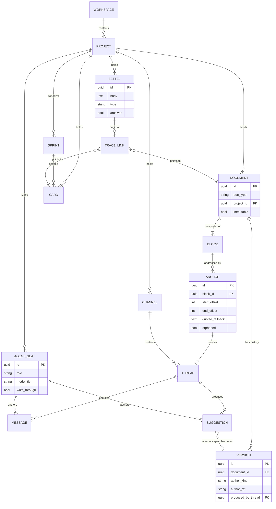

# PRD — Atrium (working codename)

An AI-native planning workspace for the **left half of the SDLC**: intake →
documents → decisions → a defined MVP. It ends where execution begins.

> **Meta-note**: this PRD instantiates the agency's own template kit
> (`docs/templates/prd.md`, #85) — the first real use of the hand-off
> artifacts shipped in #79–#92. It is a product spec, not a Ges-Talt sprint
> PRD.

**User goal**: I want one place where a half-formed idea becomes a specced,
decided, traceable piece of work — with agents from my agency sitting in the
room as participants rather than as a sidebar chatbot. Today that lives across
three tools that don't know about each other: the chat where I argued the
decision, the doc that states it, and the tracker that says to build it.
Nothing links, so the *why* evaporates and I re-litigate it a month later.

**Out of scope**: everything right of the hand-off — code, CI, deploys, PR
review, incident management, sprint velocity/burndown analytics, time
tracking. Atrium's terminal state is "a card that is ready to build, with its
lineage intact." Execution goes to GitHub Issues / Ges-Talt.

## Business case

- **Customer problem** — planning artifacts are where projects are won or
  lost, but the reasoning behind them is stored in the least durable medium
  available (chat). A document says *what* was decided; it almost never says
  *why*, *what was rejected*, or *what raw observation started it*. AI makes
  this worse today, not better: bolted-on assistants have no role, no project
  memory, and no accountability trail, so their output is unattributable and
  the human ends up re-deriving it.
- **Expected outcome** — a decision, a requirement, and a card can each be
  traced back to the conversation and the raw capture that produced them, in
  one app, with agents that hold real charters.
- **Success metrics / ROI**
  - Time from capture → linked requirement: **< 1 working session** (today:
    often never — the capture is lost).
  - **≥ 90%** of "Ready to build" cards carry a resolved upstream requirement
    link (the traceability gate, §9).
  - **Zero** unattributed document versions — every version names a human or
    a `team/role` + model.
  - Agent spend per project is **visible and bounded** (§7.6), so cost is a
    decision input rather than a monthly surprise.
- **Strategic alignment** — Atrium is the first target repo for the Ges-Talt
  agency: it consumes the hand-off kit (PRD/SRS/ADR/design-spec templates,
  traceability, DoD) and gives the roster a real product to work on.

## Requirements

Numbered, so issues can cite `prd.md §n`. Each is falsifiable and carries a
downstream verification (`docs/traceability.md`).

### §1 — Tenancy, projects, and the class model

1.1 A **Workspace** is the top-level container and the unit of billing/agent
budget. MVP: exactly one workspace per install.

1.2 A **Project** belongs to a workspace and owns its own zettels, documents,
board, channels, and agent seats. Projects are hard boundaries: no object is
shared across projects; a cross-project reference is a link, not co-ownership.

1.3 A **Sprint** is a named, dated window *within* a project (`sprint-<m>-<yy>-<dd>-<dd>`,
matching the agency convention). A sprint is a **view over objects, not a
folder** — a document is not moved into a sprint; it is *associated* with zero
or more sprints. This is load-bearing: folders force a document to have one
home and make a long-lived spec (which spans sprints) unrepresentable.

1.4 Every first-class object (zettel, document, card, thread, decision) has a
stable ID that survives rename, move, and re-association.

### §2 — Zettel-bucket (intake)

2.1 Capture is **≤ 3 seconds and ≤ 2 interactions** from anywhere in the app,
via a global hotkey. The only required field is the body.

2.2 A **Zettel** may carry an optional type (`idea` / `problem` / `quote` /
`link` / `question`) and free tags. No project assignment is required at
capture time — an unassigned zettel lands in the workspace inbox.

2.3 Zettels are **linkable to each other** (the zettelkasten property):
bidirectional links, rendered as a local graph on any zettel.

2.4 A zettel is **promoted, never consumed**. Promoting to a requirement, a
document, or a card creates a *link* and leaves the zettel intact. Archiving
hides it; nothing deletes it. Provenance is the point (§9).

2.5 Capture works **offline** and syncs later. Intake friction is the failure
mode that kills the whole product; a network round-trip is friction.

2.6 An agent may **propose** clusters over the bucket ("these 7 zettels are
about onboarding"). A human accepts or dismisses. Agents never auto-file.

### §3 — Documents

3.1 A **Document** belongs to a project, has a **type** (PRD, SRS, ADR,
design-spec, ERD, meeting-notes, freeform), and is created **from a template**
bound to that type.

3.2 **Doc-creation tools** are first-class commands: `Create PRD`,
`Create ADR`, `Create SRS`, `Create design spec`. Each stamps the template
with metadata prefilled (project, sprint, date, author, `owner`/
`last_validated` marker) — mirroring `scripts/new_adr.py` / `new_sprint_log.py`.

3.3 An ADR is **immutable once accepted**: a reversal creates a new ADR that
supersedes it. The app enforces this — editing an accepted ADR is offered as
"supersede with a new ADR," not as an edit.

3.4 Documents render and edit as **blocks** (paragraph, heading, list, table,
code, diagram). A block is the addressable unit (§5).

3.5 Documents support **Mermaid diagram blocks** (diagram-as-code), per the
blueprinting convention — no binary diagram files as source.

### §4 — Editing and versioning

4.1 Every accepted change produces a **Version** recording: author (human
identity **or** `team/role` + model), timestamp, the anchor range touched, and
the thread/prompt that produced it. **Unattributed versions are not
representable** — this is the human-AI tenancy guarantee.

4.2 A human can **compare any two versions** and **restore** any prior
version (restore is itself a new version — history is append-only).

4.3 A human can name a **checkpoint** ("reviewed with legal", "pre-rewrite").

4.4 Two write modes:
  - **Suggestion mode (default for agents)** — the agent produces a scoped
    diff; the human accepts, rejects, or edits-then-accepts.
  - **Direct mode** — humans by default; an agent only when explicitly
    granted write-through **on a specific document** (never globally).

4.5 Concurrent edits to the same block are **detected and surfaced**, not
silently merged. MVP resolves conflicts with last-write-wins **plus a
conflict banner offering both versions** — never a silent clobber.

### §5 — Anchors and inline threads (highlight → ask)

5.1 A human can select a range in a document — "lines 14 to 37" — and, from
the selection, either **ask an agent for a perspective** or **request a
change**.

5.2 **An anchor is `{block_id, start_offset, end_offset}` — never a line
number.** Line numbers shift the moment anyone edits above the selection,
which would silently re-point every existing thread at the wrong content.
*(This is the single most consequential design decision in the product; see
`## Key design decisions` below.)*

5.3 On edit, anchors **re-anchor** to the moved text. If the anchored block is
split, merged, or deleted such that re-anchoring fails, the thread becomes
**orphaned**: it stays visible, shows the original quoted text, and is flagged
for re-attachment. A thread never silently points somewhere new.

5.4 An inline thread is a **Thread scoped to an anchor** — the same object as
a channel message thread (§7), differing only in scope. One conversation
model, two surfaces.

5.5 Resolving a thread collapses it but preserves it in history and in the
trace graph (§9).

### §6 — Kanban

6.1 A **Board** per project, with columns spanning the *left* of the SDLC:
`Bucket → Exploring → Specced → Decided → Ready to build`.

6.2 A **Card** may be associated with one sprint and links to its upstream
zettel/requirement/decision.

6.3 **Entry gate**: a card cannot enter `Ready to build` without at least one
resolved upstream requirement link. This is what stops the board from
degenerating into a to-do list detached from the documents.

6.4 A card in `Ready to build` can be **handed off** — exported as a GitHub
issue carrying its lineage (links back to requirement, decision, thread).
Hand-off is Atrium's terminal state.

### §7 — Channels, messaging, and agent seats

7.1 A project has a **roster**: agency roles (`agents/INDEX.md`) assigned as
**Agent Seats**. A seat carries the role's charter — model tier, tool
boundary, negative prompts — from the agency; Atrium does not re-invent
personas.

7.2 **Channels** are per-project and optionally per-sprint. Members are humans
and agent seats, listed together.

7.3 An agent responds when **@-mentioned**. **Agents do not speak unprompted
by default** — a channel where six agents react to every message is unusable.

7.4 A seat may **subscribe** to a channel (opt-in) to respond without a
mention — e.g. `legal/general-counsel` watching `#compliance`.

7.5 A message can **cite** any object (zettel, doc range, card, version) and
renders it as a preview — citations are links in the trace graph, not text.

7.6 Every agent response displays its **token cost**, and each project has a
**monthly agent budget** that is enforced (soft warning, then hard stop). Cost
is a visible unit, inherited from the agency ledger.

7.7 An agent's reply that proposes a document change creates a **Suggestion**
(§4.4), not a wall of text to copy-paste.

### §8 — Search and navigation

8.1 Full-text search across zettels, documents, messages, and cards, scoped
to project by default.

8.2 "Where did this come from?" is one interaction from any object — opening
its trace graph (§9).

### §9 — Traceability

9.1 The chain is first-class and queryable:
`zettel → thread → requirement (doc §n) → decision (ADR) → card → hand-off`.

9.2 For any object, show **upstream** (what produced it) and **downstream**
(what it produced).

9.3 **Orphan detection**: a card in `Ready to build` with no upstream
requirement, or a requirement with nothing downstream, is flagged in a review
view. Flagged, not blocked — except the §6.3 column gate.

### §10 — Non-functional

10.1 **Anchor stability** is the top correctness risk and gets a dedicated
test tier: a property/fuzz suite that applies randomized edit sequences and
asserts no anchor ever silently re-points to different text.

10.2 Agent responses are **async and streamed**; the UI never blocks on one.
A pending response is visible and cancellable.

10.3 **Local-first for capture** (§2.5); documents sync.

10.4 Documents are the **SSOT**; chat is append-only history. When they
disagree, the document wins.

10.5 Agent output is **never auto-applied** to a document without either a
human accept or an explicit per-document write-through grant (§4.4).

## Key design decisions

These are the decisions worth recording as ADRs on day one, because reversing
them later is expensive:

| # | Decision | Why, and what it rules out |
|---|---|---|
| D1 | **Anchors are block-ID + offset, not line numbers** (§5.2) | Line-based anchors break on any edit above the range. Rules out storing selections as `[14, 37]`, and forces a block-structured document model rather than a plain-text buffer. |
| D2 | **Agents propose; humans dispose** (§4.4) | Makes AI participation auditable and reversible by construction. Rules out agents with ambient write access; costs an extra click per change, deliberately. |
| D3 | **Sprints are views, not folders** (§1.3) | A long-lived spec spans sprints. Rules out a filesystem-shaped hierarchy where every doc has exactly one home. |
| D4 | **Promotion links, never consumes** (§2.4) | Provenance survives. Rules out "convert zettel → card" flows that destroy the original. |
| D5 | **Agents are silent unless mentioned or subscribed** (§7.3) | Channel noise is what kills multi-agent chat. Rules out "helpful" proactive agents by default. |
| D6 | **The column gate at `Ready to build`** (§6.3) | The one hard enforcement that keeps board and docs coupled. Rules out using Atrium as a generic kanban. |
| D7 | **Attribution is structural, not a field** (§4.1) | An unattributed version cannot exist in the schema. Rules out "AI-assisted" as an afterthought checkbox. |
| D8 | **The app stops at hand-off** (Out of scope) | Keeps the product small and the boundary honest. Rules out becoming Jira. |

## Class model

## Prioritization (MoSCoW — MVP scope)

**Must** — §1.1–1.4, §2.1–2.4, §3.1–3.4, §4.1–4.4, §5.1–5.4, §6.1–6.3,
§7.1–7.3, §7.6, §9.1–9.2.

**Should** — §2.5 (offline), §2.6 (clustering), §3.5 (Mermaid), §7.4
(subscriptions), §8.1 (search), §9.3 (orphan detection).

**Could** — §3.3 (ADR immutability enforcement), §4.3 (named checkpoints),
§6.4 (GitHub hand-off export).

**Won't (this release)** — real-time multiplayer cursors, mobile apps,
granular permissions/roles beyond owner, multi-workspace, doc export to
PDF/Word, public sharing, comment emoji/reactions, notification digests.

**MVP definition, stated sharply**: one workspace, one project, the zettel
bucket, block-structured documents with anchors + versioning + suggestions,
**one** agent seat, and the 5-column board with its entry gate. If a person
can capture an idea on Monday and reach a traced, gated `Ready to build` card
on Friday — with an agent's perspective recorded against a specific passage —
the MVP is real.

## Stakeholder 2×2

| | High importance | Low importance |
|---|---|---|
| **High interest** | Repo owner (sole user, PM, and eng lead) — *protect & involve* | Ges-Talt roster maintainers (charters flow into seats) — *keep engaged* |
| **Low interest** | Future collaborators inheriting the workspace — *keep satisfied* (schema/attribution must survive them) | Prospective external users — *monitor* (not a design input yet) |

## Risks & assumptions

**Risks** (each lands a row in `docs/risk-register.md`)

| Risk | L | I | Mitigation | Owner (A) |
|---|---|---|---|---|
| **Anchor drift** — threads silently re-point after edits, poisoning trust in the whole trace graph | M | H | D1 block-ID anchoring + orphan state + the §10.1 fuzz suite | `logicians/software-architect` |
| **Agent noise** — multi-agent channels become unreadable | M | M | D5 silent-unless-mentioned; opt-in subscriptions only | `ai/multi-agent-systems-architect` |
| **"Another Notion"** — scope creeps into a general doc tool and the product loses its reason to exist | H | H | D8 hard boundary at hand-off; the §6.3 gate; Won't-list discipline | `pm/project-manager` |
| **Cost unpredictability** — agent spend outruns the product's value | M | M | §7.6 visible per-response cost + enforced project budget | `pm/delivery-lead` |
| **Cold start** — an empty workspace with agents in it is useless; agents need project context to be worth mentioning | H | M | Seed a project from existing docs/zettels before enabling seats; MVP ships one seat, not twelve | `pm/project-manager` |

**Assumptions**

- **"Multi-tenant human-AI" means *editorial* tenancy** — multiple actors
  (human and agent) hold simultaneous, attributed authorship inside one
  document — **not** enterprise multi-tenancy (SSO, org isolation, per-seat
  billing). This reading shapes §4 and §7 substantially; if the intent was
  enterprise tenancy, §1.1 and the permissions model change materially.
- The **Ges-Talt roster is the source of agent identities**; Atrium consumes
  charters and does not author personas.
- Single primary human user at MVP; the schema must not *preclude* more, but
  no collaboration UI is built for them.
- Documents are markdown-compatible at rest, so the agency's existing
  templates drop in unchanged.

## Constraints

- Templates and conventions come from the agency's hand-off kit — Atrium
  **consumes** `docs/templates/*` rather than defining a parallel set.
- Local-first capture implies a sync-capable store; no design may assume an
  always-online client for §2.
- No agent may hold blanket write access to documents (D2 / §10.5).

## Success criteria

- [ ] A zettel captured offline syncs, is promoted to a PRD requirement, and
      the requirement's trace graph shows the original zettel.
- [ ] Selecting a passage and asking an agent produces a threaded reply
      anchored to that passage, which survives an unrelated edit above it.
- [ ] An agent-proposed change lands as a Suggestion; accepting it creates a
      version attributed to `team/role` + model.
- [ ] A card is refused entry to `Ready to build` with no upstream
      requirement, and admitted once one is linked.
- [ ] Every document version in the system has a non-null author — verified
      by query, not by inspection.
- [ ] The anchor fuzz suite (§10.1) passes over randomized edit sequences.
