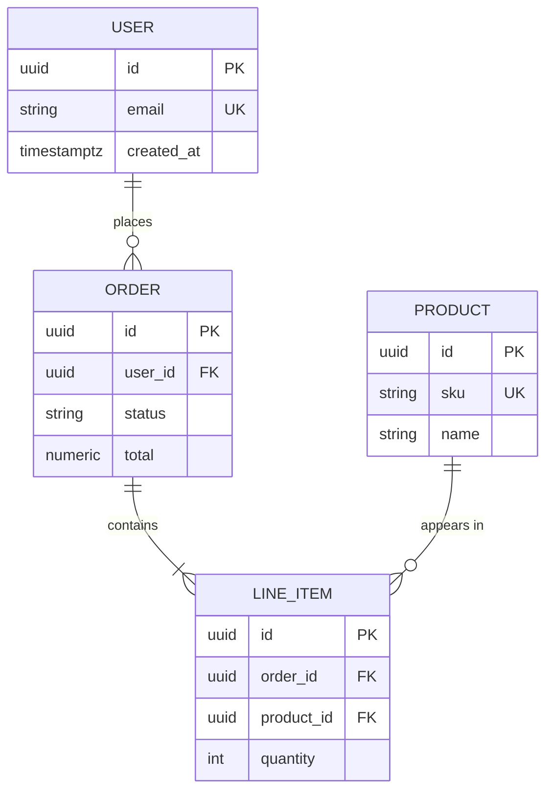

# ERD — <data model / bounded context name>

**Owner**: `data/database-optimizer` · **Traces to**: `prd.md §…` / SRS ·
**Status**: draft | reviewed | approved · **Last validated**: YYYY-MM-DD

Entity-Relationship Diagram, diagram-as-code (`docs/blueprinting.md`). The
`agents/ORCHESTRATION.md` user-journey references an ERD with no artifact —
this is that artifact's template. Prefer Mermaid `erDiagram` (renders in
GitHub) or DBML.

## Diagram

## Entities

Per entity: purpose (one line), owning service/bounded context, and lifecycle
(who creates/deletes it).

## Relationships

Cardinality and the rule behind it (`||--o{` = one-to-many). Name the
referential-integrity behavior (cascade / restrict / set-null) — it's a
correctness decision, not a default.

## Notes

- **Normalization** reviewed (and any deliberate denormalization justified).
- **Index strategy** and **retention/deletion policy** live in the database
  design, referenced here, not duplicated (SSOT).
- Multi-tenant tables name their row-isolation model
  (`security/rls-consultant`).
